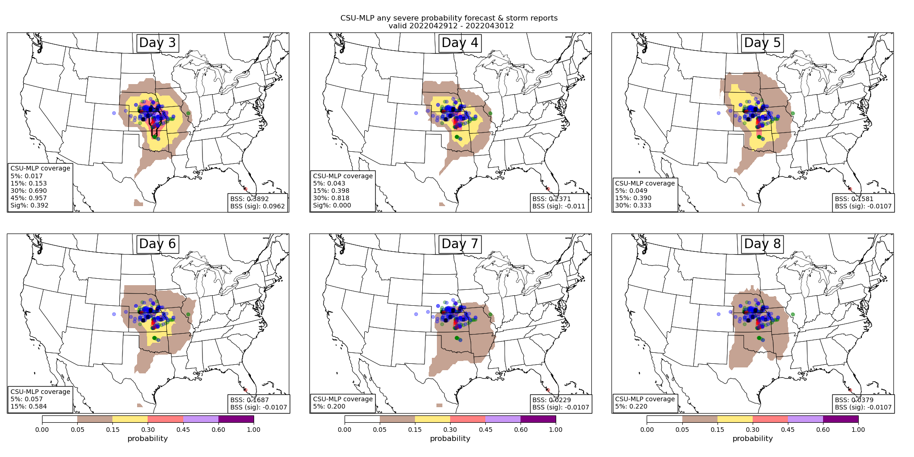

Postprocessing numerical weather prediction (NWP) model output to improve point-based and localized forecasts has been a topic of research for over 50 years (e.g., MOS). Statistical models are used to deduce relationships between pre-defined predictors and the phenomena of interest. Machine learning (ML) has emerged within atmospheric science as a new method to postprocess large NWP datasets to explicitly predict events that are unresolvable by NWP model output (e.g., extreme precipitation, tornadoes). One benefit of ML models is they are capable at learning the underlying spatio-temporal biases in NWP model output, thereby "correcting" biases in ML-based forecasts. I am interested in applying ML and deep learning (DL) techniques with global convection-parameterizing and convection-allowing models to create probablistic hazard outlooks (e.g., <a href="http://journals.ametsoc.org/doi/pdf/10.1175/MWR-D-19-0344.1"><b>Hill et al. 2020a</b></a>, <a href="https://doi.org/10.1175/WAF-D-21-0026.1"><b>Hill and Schumacher 2021</b></a>, <a href="https://doi.org/10.1175/BAMS-D-20-0186.1"><b>Schumacher et al. 2021</b></a>, <a href="https://doi.org/10.1175/WAF-D-22-0143.1"><b>Hill et al. 2023</b></a>) that are beneficial to operational forecast centers (e.g., Storm Prediction Center, Weather Prediction Center). This work has been supported by the National Oceanic and Atmospheric Administration Joint Technology Transfer Initiative program.

Operational medium-range forecasts of severe weather (i.e., days 4--8) are often produced after careful evaluation of global numerical weather prediction model output. Forecasts generated by Storm Prediction Center forecasters often under-forecast severe weather events as a result of lack of confidence in forecast solutions, or general lack of predictability in weather at these lead times. Hill et al. (2020) demonstrated a machine learning (ML) solution that could outperform human forecasters at days 2 and 3 lead time. Hill et al. (2023) further expanded the ML-based system and showed tremendous value of ML-based products out to 6 days. In particular, forecasts are considerably more skillful and resolute when lower-probabilities are included in the skill metric computations. Comparisons with the SPC's operational products further suggests that SPC underforecasts severe weather (the ML system has a slight underforecast bias as well) and skill could be improved by increasing the size of their day 4--8 outlook contours. Additional details about the model system and early results from our evaluation are documented in an article in WAF (Hill et al. (2023)).

Figure: Example day 3--8 forecasts (top left to bottom right) from the ML prediction system with probabilities contoured consistent with the colorbar. Severe weather reports (local storm reports) are encoded as blue, green, and red dots for wind, hail, and tornadoes, respectively. Fractional observation coverage and Brier Skill Score (BSS) statistics are computed for each forecast and included in the bottom left and right corners of the panels, respectively.

