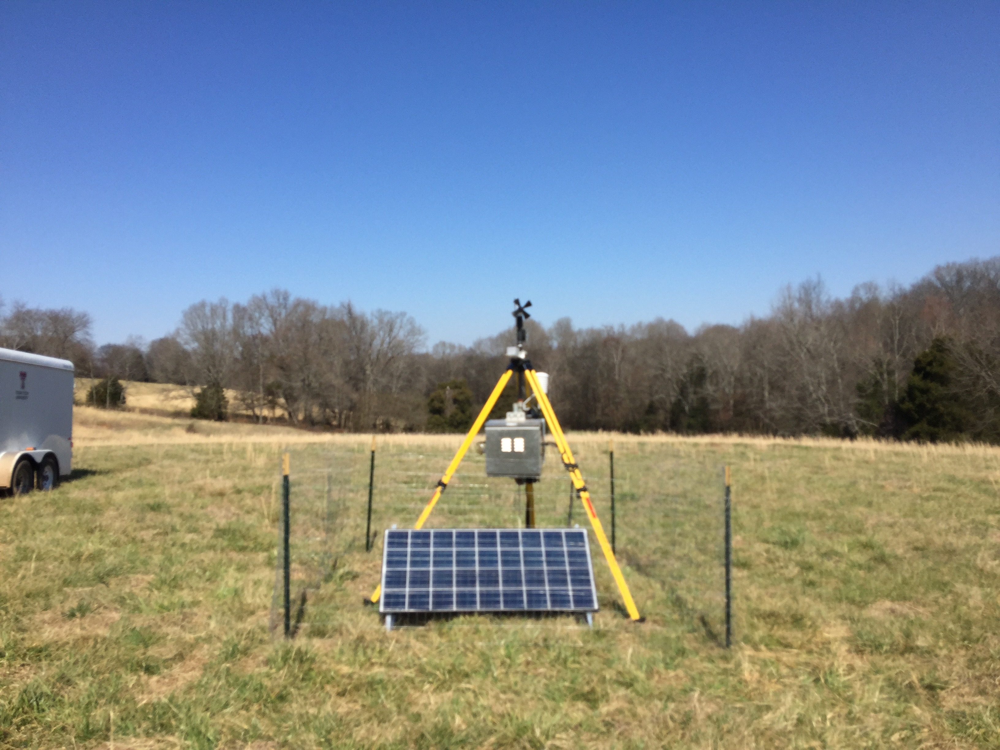

To improve forecasts of severe storms and their attendant hazards, often we first try to understand the dynamics involved that govern the processes that contribute to storm intensification, hazard initiation, etc. These investigations often take place in the form of large-scale field programs that target a specific area of research (e.g., QLCS tornadoes) that is understudied or poorly understood, or both. Dr. Hill has been involved in a number of field programs that aimed to better understand the dynamics of severe storms, either through targeted deployments of observational assets in and near supercell thunderstorms (e.g., Targeted Observations by Radars and UAS of Supercells, TORUS) or deployments of mobile and portable near-surface platforms to observe heterogenieties preceeding convection in the southeast U.S. (e.g., VORTEX-SE). These experiences have propelled an interest in engineering platforms designed to observe severe storms (e.g., small, lightweight portable observing stations) as well as the observations obtained that may elucidate new dynamic information to help advance warnings of severe-storm hazards. 

It is vital that this new information seeps into the forecast process and informs decision-makers and forecasters about potential for hazards. Increasingly, AI and machine learning is being used to better understand the dynamics involved in updrafts (Chase et al. 2024) and mesovortexgenesis (McDaniel 2026, in prep), as well as make predictions at short (e.g., Lagerquist et al. 2020) to long ranges (Hill et al. 2023). With a plethora of data collected from field campaigns, radars, and satellites over the past few decades, there is an archive of data waiting to be interrogated to help us better understand weather hazards and better prepare for them in the future. Ongoing work is trying to mine these datasets for useful information in order to better understand extreme rainfall and understand how storms may change in future climates through an ensemble lens. 

<h3>Current Projects:</h3>
<ul>
<li>Environmental and Storm-generated Controls in Modulating Quasi-linear
Convective System Vertical Vorticity: Dynamics and Detection. Support: <b><u>National Oceanic and Atmospheric Administration</u></b>.</li>

<li>Mesovortex detection with deep learning. Support: <b><u>University of Oklahoma</u></b>.</li> 

<li>Collaborative Research: Mesoscale Predictability Across Climate Regimes.</li>
Support: <b><u>National Science Foundation</u></b>.
</ul>
<!--<h3>Past Projects:</h3>-->

<h3>Papers:</h3>
<ul>
<li><a href=/publication/vse_portable/> Influence of a portable near-surface observing network on experimental ensemble forecasts of deep convection hazards during VORTEX-SE</a></li>
<li><a href=/publication/esa_dryline/>Ensemble sensitivity analysis for mesoscale forecasts of dryline convection initiation</a></li>
<li><a href=/publication/pakistan_flooding/>Multiscale Analysis of Three Consecutive Years of Anomalous Flooding in Pakistan</a></li>

</ul>
