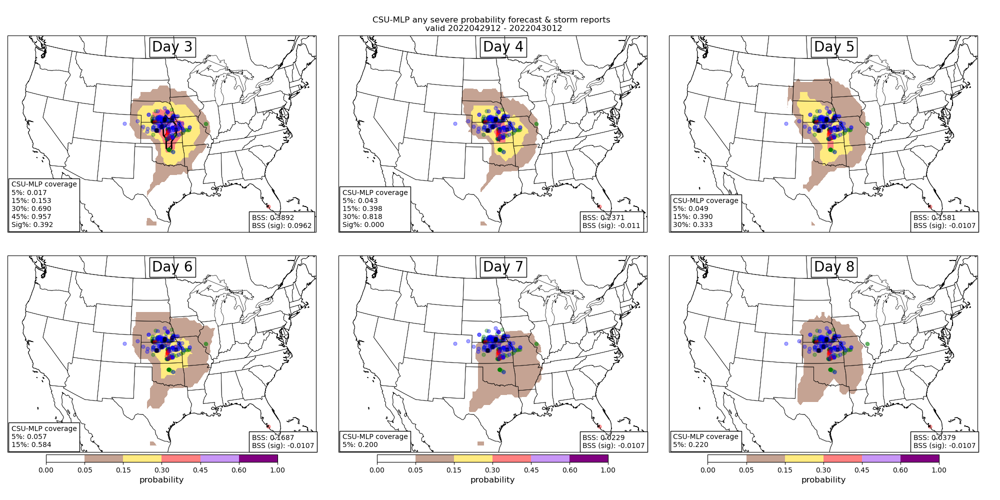
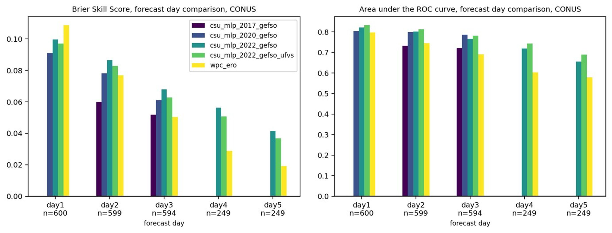

Postprocessing numerical weather prediction (NWP) model output to improve point-based and localized forecasts has been a topic of research for over 50 years (e.g., MOS). Statistical models are used to deduce relationships between pre-defined predictors and the phenomena of interest. Machine learning (ML) has emerged within atmospheric science as a new method to postprocess large NWP datasets to explicitly predict events that are unresolvable by NWP model output (e.g., extreme precipitation, tornadoes). One benefit of ML models is they are capable at learning the underlying spatio-temporal biases in NWP model output, thereby "correcting" biases in ML-based forecasts. I am interested in applying ML and deep learning (DL) techniques with global convection-parameterizing and convection-allowing models to create probablistic hazard outlooks (e.g., <a href="http://journals.ametsoc.org/doi/pdf/10.1175/MWR-D-19-0344.1"><b>Hill et al. 2020a</b></a>, <a href="https://doi.org/10.1175/WAF-D-21-0026.1"><b>Hill and Schumacher 2021</b></a>, <a href="https://doi.org/10.1175/BAMS-D-20-0186.1"><b>Schumacher et al. 2021</b></a>, <a href="https://doi.org/10.1175/WAF-D-22-0143.1"><b>Hill et al. 2023</b></a>) that are beneficial to operational forecast centers (e.g., Storm Prediction Center, Weather Prediction Center). This work has been supported by the National Oceanic and Atmospheric Administration Joint Technology Transfer Initiative program.

<h2>MEDIUM-RANGE SEVERE WEATHER FORECASTING WITH MACHINE LEARNING</h2>

Operational medium-range forecasts of severe weather (i.e., days 4--8) are often produced after careful evaluation of global numerical weather prediction model output. Forecasts generated by Storm Prediction Center forecasters often under-forecast severe weather events as a result of lack of confidence in forecast solutions, or general lack of predictability in weather at these lead times. Hill et al. (2020) demonstrated a machine learning (ML) solution that could outperform human forecasters at days 2 and 3 lead time. Hill et al. (2023) further expanded the ML-based system and showed tremendous value of ML-based products out to 6 days. In particular, forecasts are considerably more skillful and resolute when lower-probabilities are included in the skill metric computations. Comparisons with the SPC's operational products further suggests that SPC underforecasts severe weather (the ML system has a slight underforecast bias as well) and skill could be improved by increasing the size of their day 4--8 outlook contours. Additional details about the model system and early results from our evaluation are documented in an article in WAF (Hill et al. (2023)).

Figure: Example day 3--8 forecasts (top left to bottom right) from the ML prediction system with probabilities contoured consistent with the colorbar. Severe weather reports (local storm reports) are encoded as blue, green, and red dots for wind, hail, and tornadoes, respectively. Fractional observation coverage and Brier Skill Score (BSS) statistics are computed for each forecast and included in the bottom left and right corners of the panels, respectively.

<h2>EXCESSIVE RAINFALL PREDICTION WITH RANDOM FORESTS</h2>

Collaborations with NOAA's Weather Prediction Center over the past few years have yielded operationally-ready Machine Learning (ML)-based prediction systems focused on excessive rainfall. These systems have used Random Forests (RFs) to train environmental predictors against observed records of excessive rainfall, defined as instances of average recurrence interval (ARI) exceedances.

Previous prediction models were developed with the former Global Ensemble Foreast System (GEFS). In October 2020, the GEFS model was upgraded to a new dynamical core and finer resolution, which has necessitated a retraining of the RF models. Additionally, a new excessive rainfall dataset was constructed (Unified Flood Verification System; UFVS) using a variety of independent datasets allowing for a "new" construction of the RFs. This project is tasked with 1) updating previously operationalized models with the new Finite Volume Cubed-sphere GEFS and train a new system that defines excessive rainfall with the UFVS. Additionally, the original prediction system generated forecasts for days 1--3, but this project will extend the experimental forecasts out to day 8 in support of Weather Prediction Center operations.

Initial forecasts and results suggest that the UFVS-trained models have objectively slightly poorer skill than their ARI-trained counterparts over a 1.5 verification period (see Figure below). However, subjective interpretations from the warm season of 2022, during the Flash Flood and Intense Rainfall Experiment, suggest the UFVS-trained models are outperforming the ARI models. All evaluations are preliminary, and naturally suffer from sampling error and a limited sample size.

Skill and resolution metrics also suggest that forecasts can be made skillfully into days 4 and 5, although skill has decreased drastically from day 1 to 5. More work needs to be done to fully evaluate the value and utility of long-term excessive rainfall forecasts from the ML system.

Figure: (left) Brier Skill Score aggregated over 1.5 years of forecasts for multiple versions of the CSU-MLP excessive rainfall models (see Figure legend) and the WPC Excessive Rainfall Outlook (ERO) at days 1--5; days 4 and 5 have a smaller sample of forecasts, denoted by "n" along the x-axis. As in the Brier Skill Score panel, but plotted is Area under the Relative Operating Characterisitic (ROC) curve.

<h3>Current Projects Supporting this Research:</h3>
Collaborative Research: What drives the most extreme rainstorms in the contiguous
US?. Support: <b><u>National Science Foundation</u></b>.

<h3>Past Projects:</h3>
Medium-range excessive rainfall forecasts with machine learning models. Support: <b><u>National Oceanic and Atmospheric Administration Joint Technology Transfer Initiative</u></b>.  

Generating calibrated forecast guidance for severe weather beyond day 1. Support: <b><u>National Oceanic and Atmospheric Administration Joint Technology Transfer Initiative</u></b>.

<h3>Papers:</h3>
<a href=~/publication/mazureketal2024/> Can Ingredients-Based Forecasting be Learned? Disentangling a Random Forest's Severe Weather Predictions</a> 

<a href=~/publication/ob_biases/>Observation Definitions and their Implications in Machine Learning-based Predictions of Excessive Rainfall</a> 

<a href=~/publication/clark_gefs/>Extended range machine-learning severe weather guidance based on the operational GEFS</a> 

<a href=~/publication/csumlp_severe_mr/>A New Paradigm for Medium-Range Severe Weather Forecasts: Probabilistic Random Forest–Based Predictions</a>
